# 1장-01 : 자바시작. 프로그래밍, 객체

# 1. 프로그래밍이란

---

- 프로그램을 만드는 것
- 코드를 통해 컴퓨터에게 명령하는 행위
- 컴퓨터의 장점을 활용한 기술

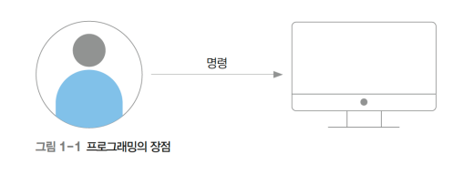

# 2. 자바 프로그래밍이란

---

- 자바의 역할
    
    사람의 명령을 컴퓨터가 이해할 수 있게 함
    
    - 자연어: 사람이 사용하는 언어(안녕하세요, Hello, 你好吗 , ... )
    - 기계어: 0과 1만으로 구성된 이진 언어(0100, 1101, ... )

자바는 프로그래밍 언어로, 코드를 통해 컴퓨터에 명령할 수 있는 언어

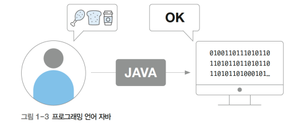

# 3. 프로그래밍 언어

---

- 프로그래밍 언어
- 소스(source) 파일
- 컴파일(compile)
- 기계어(machine language)
    
    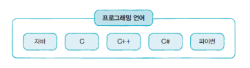
    
    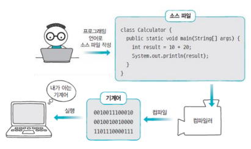
    

# 4. 프로그래밍 언어의 진화

---

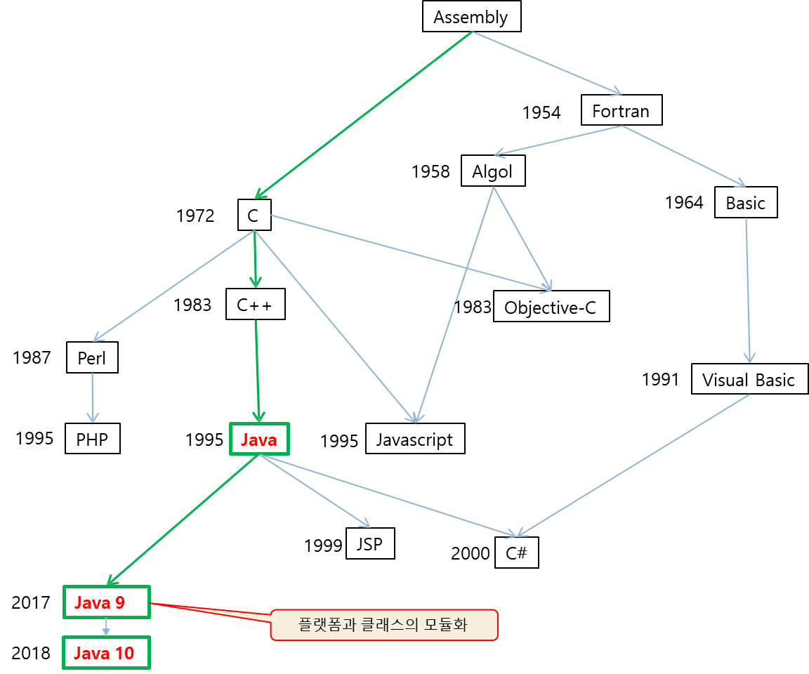

# 5. 인기 프로그래밍 언어

---

- 자바는 국내외 수많은 개발자가 많이 사용하는, 인기 프로그래밍 언어 국내의 경우, 정부와 대기업 주도의 전자정부 표준 프레임워크에서 자바가 프로그래밍 언어로 채택
- TIOBE 지수에 따르면, 자바는 2021년 9월 기준, 11.12%의 인지도로 상위 랭크

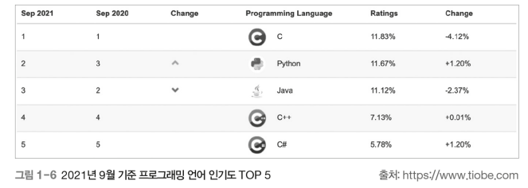

# 6. 자바 소개

---

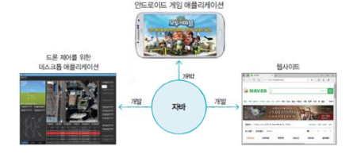

- 특징
    - 모든 운영체제에서 실행 가능
    - 객체 지향 프로그래밍(OOP : Object-Oriented Programming)
    - 메모리 자동 정리(Garbage Collector)
    - 풍부한 무료 라이브러리
    

# 7. 객체 지향 언어

---

- 객체를 조합하여 전체 프로그램을 만드는 기법(OOP)이 가능한 언어 객체지향은 간단히 조립식 프로그래밍이 가능한 언어라고 할 수 있음.
- 부품을 조립하듯, 자바는 객체를 조합하여 전체 프로그램을 만들 수 있음

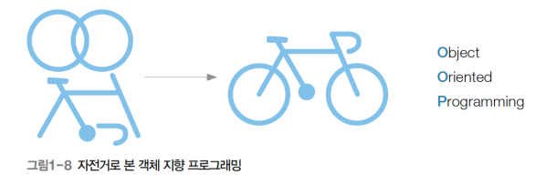

# 8. 객체(Object)

---

- 객체의 두 가지 요소
    - 속성(attribute) : 객체의 수치, 값
    - 메소드(method) : 객체의 기능, 동작

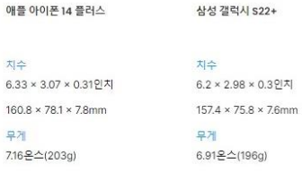

# 9. 자바의 배포판 종류

---

- 오라클은 개발 환경에 따라 다양한 자바 배포판 제공
- Java SE
    - 자바 표준 배포판(Standard Edition)
    - 데스크탑과 서버 응용 개발 플랫폼
- Java ME
    - 자바 마이크로 배포판
        - 휴대 전화나 PDA, 셋톱박스 등 제한된 리소스를 갖는 하드웨어에서 응용 개발을 위한 플랫폼
- Java EE
    - 자바 기업용 배포판
        - 자바를 이용한 다중 사용자, 기업용 응용 개발을 위한 플랫폼

# 10. 컴파일

---

- 바이트 코드 파일
- JVM

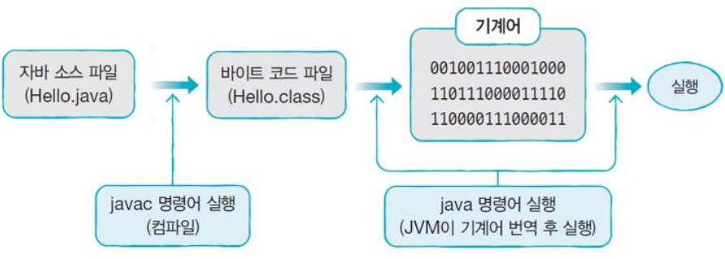

# 11. 바이트 코드 파일과 자바 가상 기계

---

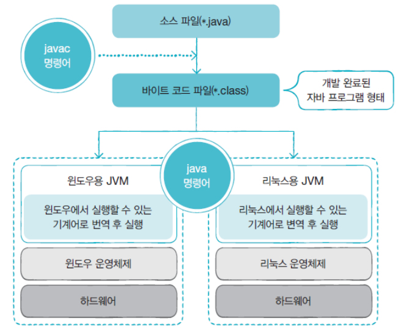

# 12. JDK와 JRE

---

- JDK(Java Development Kit)
    - 자바 응용 개발 환경(개발에 필요한 도구 포함)
        - 컴파일러, 컴파일된 자바 API 클래스들이 들어 있는 모듈 파일들, 샘플 등 포함
- JRE(Java Runtime Environment)
    - 자바 실행 환경(JVM 포함)\
    - 컴파일된 자바 API들이 들어 있는 모듈 파일
- JDK와 JRE의 개발 및 배포
    - 오라클의 Technology Network의 자바 사이트에서 다운로드
        - [http://www.oracle.com/technetwork/java/index.html](http://www.oracle.com/technetwork/java/index.html)
- JDK의 bin 디렉토리에 포함된 주요 개발 도구
    - javac : 자바 소스를 바이트 코드로 변환하는 컴파일러
    - java : 자바 응용프로그램 실행기. 자바 가상 기계를 작동시켜 자바 프로그램 실행
    - javadoc : 자바 소스로부터 HTML 형식의 API 도큐먼트 생성
    - jar : 자바 클래스들(패키지 포함)을 압축한 자바 아카이브 파일(.jar) 생성 관리
