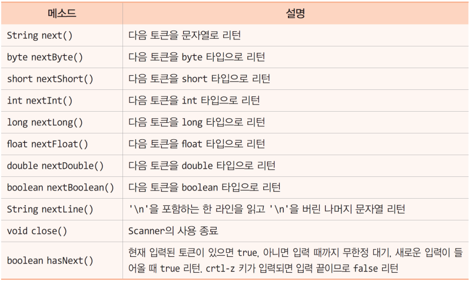

# 2장-06 : Scanner, 연산자

## ★ 목차

1. 자바에서 키 입력
2. Scanner 클래스
3. 토큰이란
4. Scanner를 이용한 키 입력
5. Scanner 주요 메소드
6. 연산자
7. 증감 연산
8. 대입 연산

## 1. 자바에서 키 입력

---

- System.in
    - 키보드로부터 직접 읽는 자바의 표준 입력 스트림
    - 키 값을 바이트(문자 X)로 리턴
- System.in을 사용할 때 문제점
    - 키 값을 바이트 데이터로 넘겨주므로 응용프로그램이 문자 정보로 변환해야 함


 

## 2. Scanner 클래스

---

- Scanner클래스
    - System.in에게 키를 읽게 하고, 읽은 바이트를 문자, 정수, 실수, 불린, 문자열 등 다양한 타입으로 변환하여 리턴
        - java.util.Scanner 클래스
- 객체 생성
    - 
    
    ```java
    import Java.util.Scanner; // import 문 필요
    ...
    Scanner a = new Scanner(System.in); // Scanner 객체 생성
    ```
    
    
    
    - System.in에게 키를 읽게 하고, 원하는 타입으로 변환하여 리턴

## 3. 토큰이란

---

- 문자열에서 문법적으로 더 이상 나눌 수 없는 기본적인 언어요소

예시)

- 주민등록번호 : 880111-1111111 ⇒ ‘-’가 토큰
- pm:05:12 ⇒ ‘:’가 토큰
- 2023/02/22 ⇒ ‘/’가 토큰

## 4. Scanner를 이용한 키 입력

---

- Scanner에서 키 입력 받기
    - Scanner는 입력되는 키 값을 공백으로 구분되는 아이템 단위로 읽음
    - 공백 문자 : ‘\t’, ‘ ’
- 개발자가 원하는 다양한 타입의 값으로 바꾸어 읽을 수 있음


 

## 5. Scanner 주요 메소드

---



 

## 6. 연산자

---

연산자(operator)란 데이터 연산을 위한 기호

자바는 다양한 연산자를 제공함


- 연산 : 주어진 식을 계산하여 결과를 얻어내는 과정


- 연산자 우선순위(operator precedence)란 연산자 간 실행 순서의 기준
    - 연산자 우선순위가 높은 연산자부터 먼저 계싼됨
    - int result = 3  +  8  *  (3  -  1);
    
    
    

## 7. 증감 연산

---

- 1 증가 혹은 감소 시키는 연산
    - ++, —


 

## 8. 대입 연산

---

- 연산의 오른쪽 결과를 왼쪽 변수에 대입
    - =, +=, -=, …
    - 
    
    ```java
    int a = 1, b = 3;
    a = b;    // b값을 a에 대입하여 a = 3
    a += b;   // a = a + b의 연산이 이루어져 a = 6, b = 3 그대로
    ```
    
    
