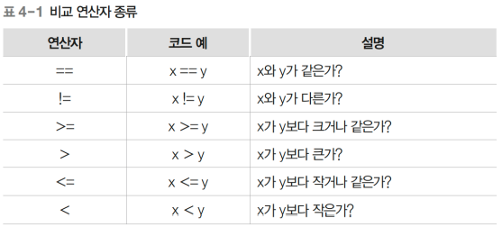

# 2장-07 : 연산자 종류

## ★ 목차

1. 비교 연산자
2. 논리 연산자
3. 비교 연산과 논리 연산의 복합 사례
4. 삼항(조건) 연산자

## 1. 비교 연산자

---

비교 연산자란 두 값을 비교하는 기호이다

연산의 결과가 참인 경우 true, 아니면 false를 반환




 예시)

```java
System.out.println(7 > 4);      // true
System.out.println(3 == 5);     // false
System.out.println(5 != 10);    // true
```

## 2. 논리 연산자

---

논리 연산자는 두 논리값을 토대로 새 논리값을 반환하는 기호이다

연산자 종류로는 AND(&&), OR(\|\|), XOR(^), NOT(!)이 있음

- AND 연산자
    - 논리값이 둘 다 참인 경우에만 참, 그 외에는 거짓을 반환
    
    
    

 

- OR 연산자
    - 두 논리값 중 하나라도 참이면 참, 둘 다 거짓인 경우에만 거짓
    
    
    

- XOR 연산자
    - 두 논리값이 다르면 참, 같은 경우 거짓을 반환
    
    
    

- Not 연산자
    - 논리값의 결과를 반대로 변경
    
    
    

## 3. 비교 연산과 논리 연산의 복합 사례

---

```java
// 나이(int age)가 20대인 경우
(age >= 20) && (age < 30)

// 문자(char c)가 대문자인 경우
(c >= 'A') && (c <= 'Z')

// (x, y)가 (0, 0)과 (50, 50)의 사각형 내에 있음
(x >= 0) && (y >= 0) && (x <= 50) && (y <= 50)
```

주의)

```java
20 <= age < 30 //오류
```

## 4. 삼항(조건) 연산자

---

삼항 연산자는 조건식에 따른 반환 값을 지정하는 문법

조건 식이 참이면 A, 거짓이면 B가 반환

```java
(조건식) ? A : B;
```

예시)


```java
// 점수가 60점 이상인 경우 합격, 아닌 경우 불합격을 반환
int score = 88;
String result = (score >= 60) ? "합격" : "불합격";
```
