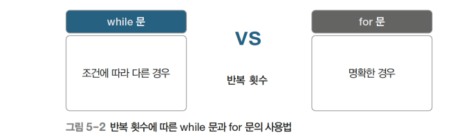
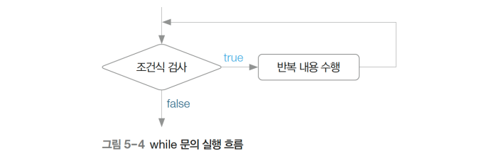
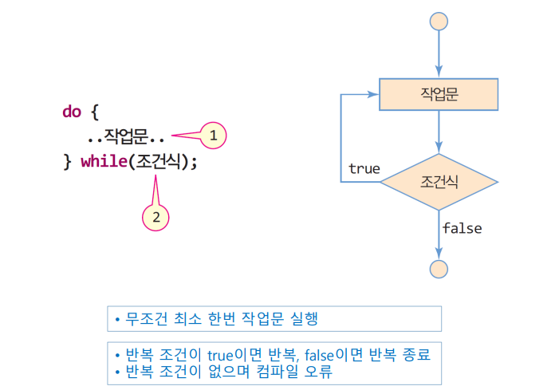
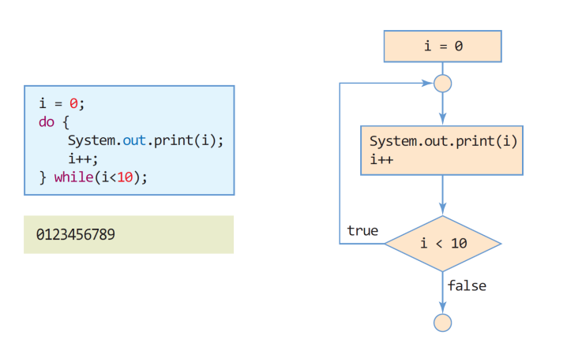

# 3장-01 : 반복문(while, do_while)

## ★ 목차

1. 반복문이란
2. 반복문의 필요성
3. 반복문의 분류
4. 반복문의 주의점
5. 반복문의 특징
6. while 문
7. do_while 문

## 1. 반복문이란

---

- 반복문(loop)은 규칙적 반복 코드를 단순화하는 문법
- 수천 or 그 이상의 코드를 단 몇 줄로 줄일 수 있음


 

## 2. 반복문의 필요성

---

- 가령 1부터 1,000까지의 숫자를 일일이 출력해야 한다면 코드가 매우 기렁짐

```java
System.out.println(1);
System.out.println(2);
System.out.println(3);
...
System.out.println(1000); // 숫자만 바꾸어서 1,000번 반복
```

이럴 때 반복문을 사용하면 수비고 빠르게 코드를 완성할 수 있음

```java
for(int i = 0; i < 1000; i++){
	System.out.println(i);
}
```

 

## 3. 반복문의 분류

---

- 반복문은 크게 while 문과 for 문으로 구분
    - while 문 : 반복 횟수가 명확하지 않을 때 사용하기 적합
    - for 문 : 반복 횟수가 명확할 때 사용하기 적합
    
    
    

## 4. 반복문의 주의점

---

- 반복문 사용 시 무한 루프(infinite loop)를 주의해야 함
    - 무한 루프 : 반복이 끊임없이 동작하는 상황
    - 실행 흐름이 반복문에 갇히면 프로그램을 멈출 수 없음
    
    
    

 

## 5. 반복문의 특징

---

- while 문
- do while 문
- for 문


 

## 6. while 문

---

- while 문은 반복 횟수가 조건에 따라 변할 때 사용하기 좋은 반복문
    
    ```java
    while(ⓐ조건식){
    	ⓑ반복 내용 // 조건식이 거짓이 될 때까지 ⓐ->ⓑ, ⓐ->ⓑ, ... 반복
    }
    ```
    
    - while 문은 ⓐ조건식이 참인 경우, ⓑ중괄호 안쪽 코드를 반복
    - 해당 과정은 조건 식이 거짓이 되어야만 반복을 벗어날 수 있음



## 7. do_while 문

---




