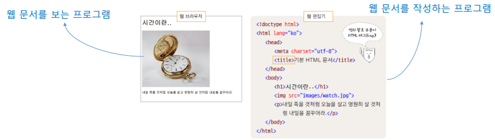
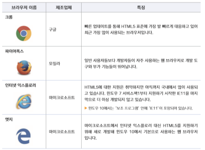
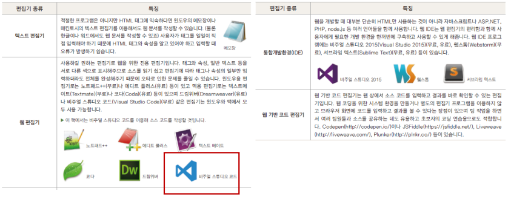
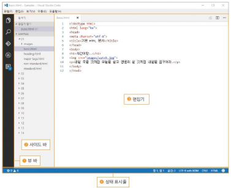
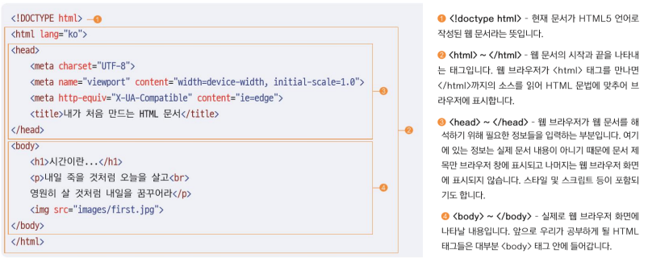

# 1장 : HTML기본 다지기

## ★ 목차

1. HTML이란 무엇일까?
2. 웹 표준이란 무엇일까?
3. 왜 HTML5와 CSS3를 공부해야 할까?
4. 웹 브라우저와 웹 편집기
5. HTML 기본 문서 구조

## 1. HTML이란 무엇일까?

---

- 컴퓨터에서 사용하는 모든 파일에는 각각 고유의 형식이 있다.
- 웹에서는 웹에 맞는 형식인 *.html(또는 *.htm)로 문서를 저장해야 한다.
- 텍스트뿐만 아니라 이미지, 링크 등 여러 요소들을 다루고 표시할 수 있어야 한다.
- 웹에서 자유롭게 오갈 수 있는 웹 문서를 만드는 언어가 HTML



 

## 2. 웹 표준이란 무엇일까?

---

- 웹 사이트를 만들 때 지켜야 하는 약속들을 정리한 것
- 웹 표준을 지켜 사이트를 제작하면 장소나 브라우저와 상관없이 쉽게 웹 사이트를 볼 수 있다.
- 웹 표준으로 문서 하나를 만들면 어떤 기기에서나 볼 수 있기 때문에 웹 개발자와 디자이너의 시간 절약
- HTML5로 문서를 만드는 것 = 웹 표준을 지킨 문서를 만드는 것

 

## 3. 왜 HTML5와 CSS3를 공부해야 할까?

---

- 왜 HTML5와 CSS3를 공부해야 할까?
    - 최신 웹 표준에 맞는 웹 사이트 제작
        - HTML5와 CSS3를 사용하면 사용자가 접속한 기기에 따라 사이트 레이아웃을 다양하게 바꿀 수 있다.
- 사이트와 블로그 수정이 쉽다
    - HTML5를 공부하면 사이트나 블로그 소스를 이해할 수 있고 사이트를 원하는 모습으로 바꿀 수 있다.

## 4. 웹 브라우저와 웹 편집기

---





- 비주얼 스튜디오 코드
    - 대부분의 주요 플랫폼에서 모두 사용할 수 있다
    - 태그와 CSS속성을 친절히 안내한다
    - 태그와 CSS속성을 간편하게 입력할 수 있다
    - 확장이 쉽다
    
    
    

 

## 5. HTML 기본 문서 구조

---

- 태그, 이건 꼭 알아두자
    - 태그는 ‘<’와 ‘>’를 이용해 구분한다
    - 태그는 소문자로 쓴다
        - ex) ``````
    - 여는 태그와 닫는 태그를 정확히 입력한다(닫는 태그가 없는 태그도 있다)
    - 적당히 들여쓴다
    - 태그는 속성과 함께 사용할 수 있다
        - ex) ``````

- HTML 문서 기본 구조 살펴보기
    
    
