# 2장 : 텍스트 관련 태그들

## ★ 목차

1. 텍스트를 묶어주는 태그
2. 텍스트를 한 줄로 표시하는 태그
3. 기타 텍스트 관련 태그들
4. 목록을 만드는 태그
5. 표를 만드는 태그

## 1. 텍스트를 묶어주는 태그

---

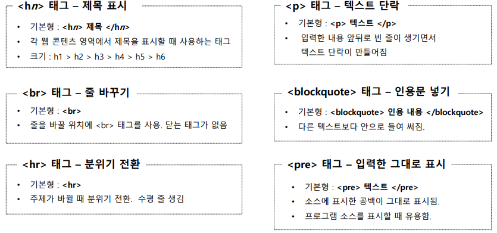


 

## 2. 텍스트를 한 줄로 표시하는 태그

---

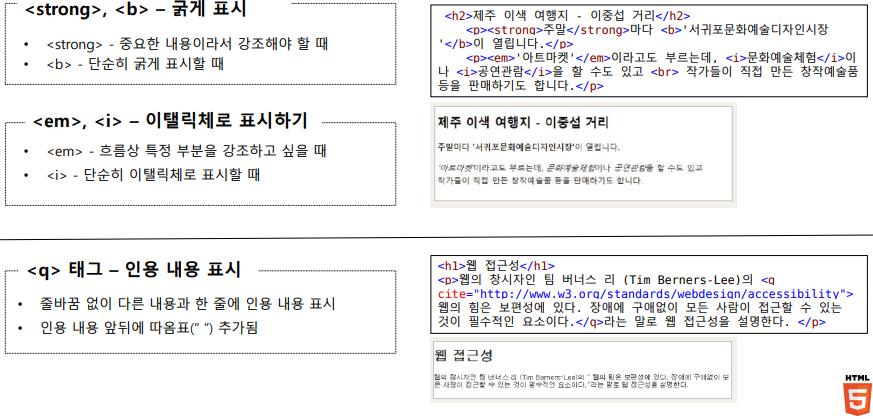


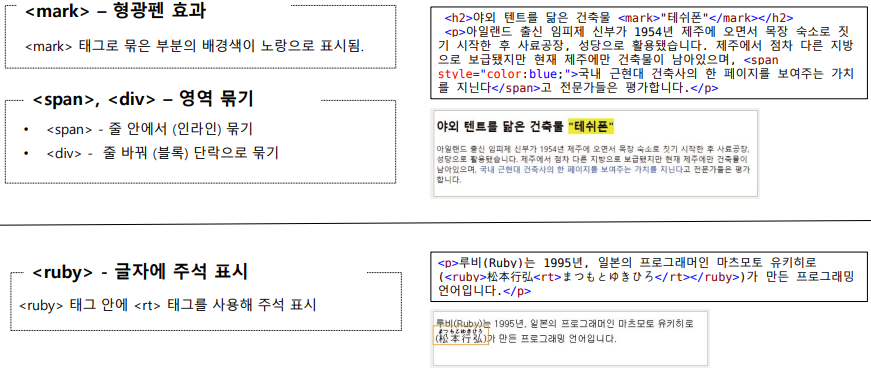


 

## 3. 기타 텍스트 관련 태그들

---

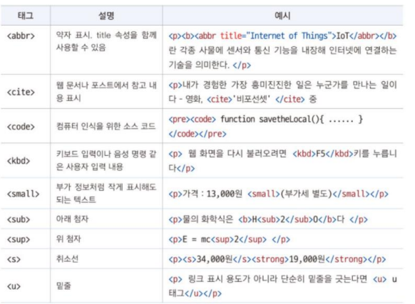


## 4. 목록을 만드는 태그

---

- ```<ul>, <li>``` : 순서 없는 목록
    - 각 항목 앞에 불릿이 붙여짐
    - CSS의 list-style-type 속성으로 불릿 수정
- ```<ol>, <li>``` : 순서 목록
    - 각 항목 앞에 숫자가 붙여짐
    - <ol> 태그의 속성
        - type 속성 : 불릿 앞의숫자 조정
        - start 속성 : 중간 번호부터 수정
        - reserved 속성 : 역순으로 표시

```html
<ul>
	<li>1일차
		<ol type="a">
			<li>해녀박물관</li>
			<li>낚시체험</li>
		</ol>
	</li>
	<li>2일차
		<ol type="a" start="3">
			<li>용눈이오름</li>
			<li>만장굴</li>
			<li>카약체험</li>
		</ol start>
	</li>
</ul>
```

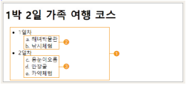


★ 여러 항목이 나열될 때 ```</li>``` 태그를 생략해도 다음에 오는 ```<li>``` 태그를 만나면 자동으로 그 전에 ```</li>```태그가 있는 것처럼 인식함

- ```<dl>, <dt>, <dd>``` : 설명 목록
    - ‘제목’과 그에 대한 ‘설명’으로 이루어진 목록
    - ```<dl>```과 ```<dt>, <dd>``` 태그 사용
    - 하나의 ```<dt>```에 여러개의 ```<dd>```값을 가질 수 있다.
    
    ```html
    <dl>
    	<dt>올레 1코스</dt>
    	<dd>코스 : 시흥 초등학교 옆 - 광치기 해변</dd>
    	<dd>거리 : 14.6km(4~5시간)</dd>
    	<dd>난이도 : 중</dd>
    	<dt>올레 2코스</dt>
    	<dd>코스 : 광치기 해변 - 온평 포구</dd>
    	<dd>거리 : 14.5km(4~5시간)</dd>
    	<dd>난이도 : 중</dd>
    </dl>ㅇ
    ```
    

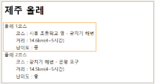


 

## 5. 표를 만드는 태그

---

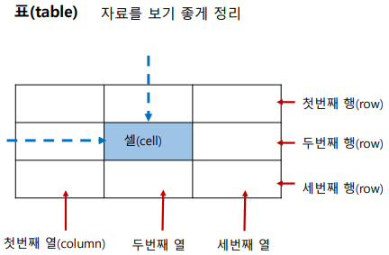


- 표를 만드는 태그
    - ```<table> ~ </table>``` : 표 전체
    - ```<tr> ~ </tr>``` : 행
    - ```<td> ~ </td>``` : 셀, ```<th> ~ </th>``` 제목 셀

- ex) 2 * 3 (2행 3열) 표
    
    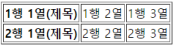

    
    ```html
    <table>
    	<tr>
    		<th>1행 1열(제목)</th>
    		<td>1행 2열</td>
    		<td>1행 3열</td>
    	</tr>
    	<tr>
    		<th>2행 1열(제목)</th>
    		<td>2행 2열</td>
    		<td>2행 3열</td>
    	</tr>
    </table>
    ```
    

- colspan, rowspan 속성 : 행 or 열 병합
    
    

    
    ex)
    
    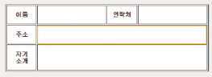

    
    ```html
    <table border="1">
    	<colgroup>
    		<col style="width:100px;">
    		<col style="width:300px;">
    		<col style="width:100px;">
    		<col style="width:300px;">
    	</colgroup>
    	<tr>
    		<th>이름</th>
    		<td></td>
    		<th>연락처</th>
    		<td></td>
    	</tr>
    	<tr>
    		<th>주소</th>
    		<td colspan="3"></td>
    	</tr>
    	<tr>
    		<th>자기소개</th>
    		<td colspan="3"></td>
    	</tr>
    </table>
    ```
    

- ```<caption>``` : 표 제목
    - 제목이 위쪽 중앙에 표시됨
    - ex)
    
    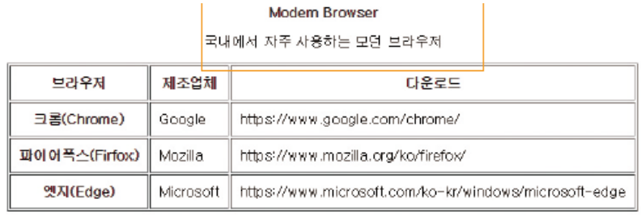

    
    ```html
    <table border="1">
    	<caption>
    		<strong>Modern Browser</strong>
    		<p>국내에서 자주 사용하는 모던 브라우저</p>
    	</caption>
    	<tr> …… </tr>
    	<tr> …… </tr>
    	<tr> …… </tr>
    	<tr> …… </tr>
    </table>
    ```
    

- ```<figure>, <figcaption>``` : 표 제목
    - ```<figcpation>``` 위치에 따라 표의 위나 아래에 제목 표시
    - ex)
    
    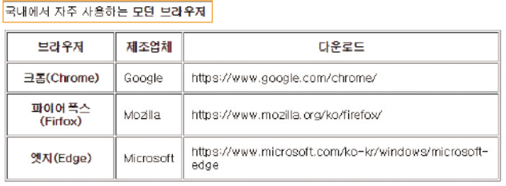

    
    ```html
    <figure>
    	<figcaption>
    		<p>국내에서 자주 사용하는 <b>모던 브라우저
    </b></p>
    	</figcaption>
    	<table border="1">
    		<tr> …… </tr>
    		<tr> …… </tr>
    		<tr> …… </tr>
    		<tr> …… </tr>
    	</table>
    </figure>
    ```
    

- ```<thead>, <tbody>, <tfoot>``` : 표 구조 정의하기
    
    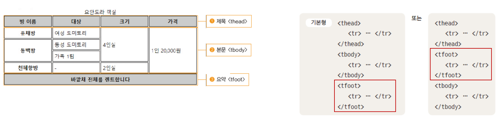

    
    - 표의 구조를 제목 부분과 실제 본문 그리고 요약 부분이 있는 부분으로 나눈다.
    - ```<thead>, <tbody>, <tfoot>``` 태그 사용
    - 시각 장애인도 화면 판독기를 통해 표의 구조를 쉽게 이해할 수 있다.
    - 표의 본문이 길 경우 자바스크립트를 이용하면 제목과 바닥 부분을 고정하고 본문만 스크롤 되도록 할 수 있다.
    - ex)
    
    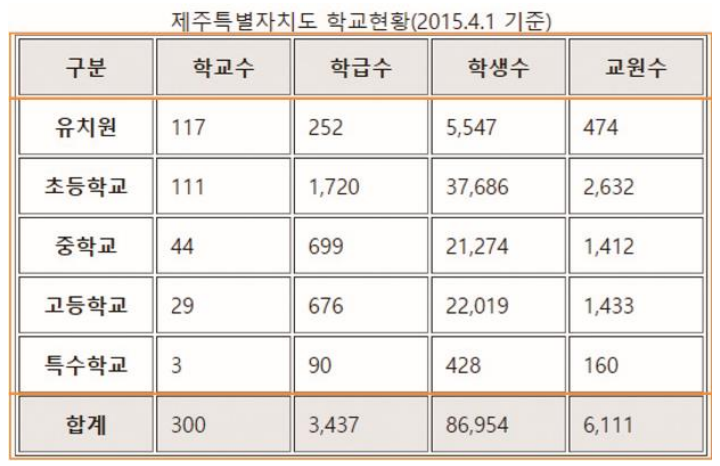

    
    ```html
    <table>
    	<caption>제주특별자치도 학교현황(2015.4.1 기준)</caption>
    	<thead>
    		<tr>
    			<th>구분</th>
    			<th>학교수</th>
    			<th>학급수</th>
    			<th>학생수</th>
    			<th>교원수</th>
    		</tr>
    	</thead>
    	<tbody>
    		<tr>
    			<th>유치원</th>
    			<td>117</td>
    			<td>252</td>
    			<td>5,547</td>
    			<td>474</td>
    		</tr>
    		<tr> …… </tr>
    		<tr> …… </tr>
    		<tr> …… </tr>
    		<tr> …… </tr>
    	</tbody>
    	<tfoot>
    		<tr>
    			<th>합계</th>
    			<td>300</td>
    			<td>3,437</td>
    			<td>86,954</td>
    			<td>6,111</td>
    		</tr>
    	</tfoot>
    </table>
    ```
    

- ```<col>, <colgroup>``` – 열끼리 묶어 스타일 지정
    - ```<col>``` 태그 - 한 열에 있는 모든 셀에 같은 스타일을 적 용
    하려고 할 때 사용. 닫는 태그 없음
    - ```<col>``` 태그에 span 속성을 사용해 여러 열을 묶을 수  있음
    - ```<colgroup>``` 태그로 여러 열을 묶을 수도 있는데, ```<colgroup>``` 태그 안에 묶는 열의 개수만큼 ```<col>```태그를 사용, 닫는 태그 있음
    - ```<col>``` 태그와 ```<colgroup>``` 태그는 ```<caption>``` 태그 뒤에, ```<tr>, <td>``` 태그 전 에 사용해야 함
    - <colgrouoop> 태그 안에 있는 ```<col>``` 태그를 비롯해 단독으로 사용한 ```<col>``` 태그의 개수와 표의 열의 개수가 같아야 함
    - ex)
    
    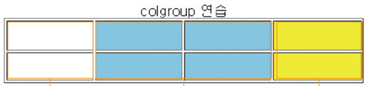

    
    ```html
    <table border="1">
    	<caption>colgroup 연습</caption>
    	<colgroup>
    		<col>
    		<col span="2" style="background-color:blue;">
    		<col style="background-color:yellow">
    	</colgroup>
    	<tr>
    		<td></td>
    		<td></td>
    		<td></td>
    		<td></td>
    	</tr>
    	<tr>
    		<td></td>
    		<td></td>
    		<td></td>
    		<td></td>
    	</tr>
    </table
    ```
