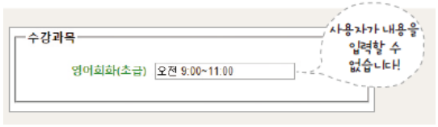

# 4장 : 폼 관련 태그들

## ★ 목차

1. 폼 만들기
2. ```<input>```태그
3. ```<input>```태그의 다양한 속성
4. 여러 데이터 나열해 보여주기
5. 기타 다양한 폼 요소들

## 1. 폼 만들기

---

- 웹에서 만나는 폼
    - 사용자가 웹 사이트로 정보를 보낼 수 있는 요소들은 모두 폼(form)
    - 폼과 관련된 대부분의 작업들은 정보를 저장하거나 검색하거나 수정하는 일들
    - 이런 작업은 모두 데이터베이스를 기반으로 한다.
    - 아이디를 입력하는 텍스트 필드나 버튼 같은 폼의 형태를 만드는 것은 HTML태그
    - 폼에 입력한 사용자 정보를 처리하는 것은 ASP나 PHP같은 서버 프로그래밍 이용
    - 여기에서는 서버 프로그래밍에 대해서는 다루지 않고 브라우저 에 표시될 폼을 만드는 태그들에 대해 살펴본다.
    
    
    

- 폼의 동작 방식


- ```<form>``` 태그
    - 폼을 만드는 기본 태그. ```<form>```과 ```</form>``` 사이에 여러 폼 요소 삽입
    
    ```html
    <form [속성="속성 값"]> 여러 폼 요소 </form>
    ```
    

 

- ```<form>```태그에서 사용하는 속성들
    
    
    
    - 예시)
    
    ```html
    <form action="search.php" method="post">
    	<input type="text" title="검색">
    	<input type="submit" value="검색">
    </form>
    ```
    
    
    

- ```<label>```태그
    - 폼 요소에 레이블(텍스트)을 붙이는 태그
    - 라디오 버튼이나 체크 박스에서 텍스트 부분을 클릭해도 라디오 버튼과 체크 박스 버튼이 선택된다.
        - 방법1)
        
        ```html
        <label [속성="속성 값"]> 레이블 <input ...> </label>
        <!-- ex) -->
        <label아이디(6자 이상)<input type="text" ...></label>
        ```
        
        - 방법2)
        
        ```html
        <label for="id이름"> 레이블 </label>
        <input id="id이름" [속성 = "속성 값"]>
        <!-- ex) -->
        <label for="user-id">아이디(6자 이상)</label>
        <input type="text" id="user-id">
        ```
        

- ```<fieldset>```태그
    - 폼 요소를 그룹으로 묶는 태그
    
    ```html
    <fieldset [속성="속성 값"]> ... </fieldset>
    ```
    

- ```<legend>```태그
    - 그룹으로 묶는 구역에 제목을 붙이는 태그
    - 예시)
    
    
    
    ```html
    <form>
    	<fieldset>
    		<legend>개인 정보</legend>
    		<ul>
    			<li>
    				<label for="name">이름</label>
    				<input type="text" id="name">
    			</li>
    			<li>
    				<label for="mail">메일 주소</label>
    				<input type="text" id="mail">
    			</li>
    		</ul>
    	</fieldset>
    	<fieldset>
    		<legend>로그인 정보</legend>
    		<ul>
    			<li>
    				<label for="id">아이디</label>
    				<input type="text" id="id">
    			</li>
    			<li>
    				<label for="pwd">비밀번호</label>
    				<input type="text" id="pwd">
    			</li>
    		</ul>
    	</fieldset>
    </form>
    ```
    

## 2. ```<input>```태그

---

- 사용자가 입력하는 부분은 거의 ```<input>```태그를 이용해 처리
- 입력하는 내용의 종류는 ```<input>``` 태그의 type 속성을 통해 지정
- type 속성 값에 따라 함께 사용할 수 있는 속성들도 달라진다

```html
<input type="유형" [속성="속성 값"]>
<!-- ex) -->
<input type="text" id="user_name" size="10">
<input type="text" id="addr" size="60">
```

[https://www.notion.so](https://www.notion.so)

- ```<input>``` 태그의 id 속성
    - 여러 번 사용된 폼 요소를 구분하기 위해 사용
    - ```<label>``` 태그를 이용해 캡션을 붙일 수 있다.
    - CSS를 이용해 각 요소마다 다른 형태로 꾸밀 수 있다.
    
    
    

 

- type=”hidden”
    - 화면 상의 폼에는 보이지 않는다.
    - 폼을 서버로 전송할 때 함께 전송되는 요소
    
    ```html
    <input type="hidden" name="이름" value="서버로 넘길 값">
    ```
    

- type=”password”
    - 비밀번호 입력란
    - 사용자가 입력하는 내용이 ‘*’나 ‘●’로 표시된다.
    
    ```html
    <input type="password" [속성="속성 값"]>
    ```
    

- type=”text”
    - 한 줄짜리 텍스트 입력 필드
    - 주로 아이디나 이름, 주소 등 텍스트 입력
    
    ```html
    <input type="text" [속성="속성 값"]>
    ```
    

- 텍스트 필드와 패스워드 필드의 속성(단, 패스워드 필드에는 value 속성이 없음)


- type=”search”
    - 검색 필드
    - 검색 창에 x표시가 되어 검색어 삭제 쉬움
    
    ```html
    <input type="Search" [속성="속성 값"]>
    ```
    

- type=”email”
    - 메일 주소 입력 필드
    - 메일 주소 형식 자동 체크
    
    ```html
    <input type="email" [속성="속성 값"]>
    ```
    

- type=”url”
    - 웹 주소 필드
    - “[http://”로](http://로) 시작하는 사이트 주소 입력
    
    ```html
    <input type="rul" [속성="속성 값"]>
    ```
    
- type=”tel”
    - 전화번호 입력 필드
    - 사용자 입력을 체크하지는 않음
    
    ```html
    <input type="tel" [속성="속성 값"]>
    ```
    

- type = “number”
    - 숫자 입력 필드. 브라우저에 따라 스핀 박스로 표시됨
    
    ```html
    <input type="number" [속성="속성 값"]>
    <!-- ex) -->
    <b>주문 개수 : </b> <input type="number" min="1" max="5" value="1"> 개
    ```
    
    
    

- type=”range”
    - 숫자 입력 필드. 슬라이스 막대를 이용해 숫자 입력
    
    ```html
    <input type="range" [속성="속성 값"]>
    <!-- ex -->
    <b>주문 개수 : </b> <input type="range" min="1" max="5" value="1"> 개
    ```
    
    - 예시)
    
    
    
    ```html
    <ul>
    	<li>
    		<label class="reg" for="member">참여인원<small>(최대10명)</small></label>
    		<input type="number" id="member" value="1" min="0" max="10" step="1">
    	</li>
    	<li>
    		<label class="reg" for="stuffs">지원물품<small>(1인당 5개)</small></label>
    		<input type="number" id="stuffs" value="1" min="0" max="50" step="5">
    	</li>
    	<li>
    		<label class="reg" for="satis">희망 단계<small>(하,중,상)</small></label>
    		<input type="range" id="satis" value="1" min="1" max="3">
    	</li>
    </ul>
    ```
    

- type=”radio”
    - 여러 항목 중 하나만 선택할 때
    
    ```html
    <input type="radio" [속성="속성 값"]>
    ```
    

- type=”checkbox”
    - 여러 항목 중 둘 이상을 선택할 때
    
    ```html
    <input type="checkbox" [속성="속성 값"]>
    ```
    
    
    

- type=”color”
    - 색상 표에서 색상 선택
    
    ```html
    <input type="color" [value="기본 색" 속성="속성 값"]>
    ```
    

- type=”date”, type=”month”, type=”week”
    - 달력 이용해 날짜 입력
    
    ```html
    <input type="date | month | week" [value="기본 값" 속성="속성 값"]>
    ```
    
    | 유형 | 설명 |
    | --- | --- |
    | date | 날짜를 선택합니다 |
    | month | 월(month)과 연도(year)를 선택합니다. |
    | week | 주(week)와 연도(year)를 선택합니다. |
    - 예시)
    
    
    
    ```html
    <label><input type="date" id="start"></label>
    <label><input type="date" id="end"></label
    ```
    

- type=”time”, type=”datetime-local”
    - 시간 입력
    
    ```html
    <input type="time | datetime | datetime-local" [value="기본 값" 속성="속성 값"]>
    ```
    
    - 예시)
    
    
    
    ```html
    <label>시작 시간<input type="time" value="09:00" id="start"></label>,
    <label>종료 시간<input type="time" value="18:00" id="end"></label>
    <label>시작 시간<input type="datetime-local" value="2016-03-02T09:00" id="start"></label>,
    <label>종료 시간<input type="datetime-local" value="2016-03-02T18:00" id="end"></label>
    ```
    
    - 사용하는 속성
    
    | 속성 | 설명 |
    | --- | --- |
    | min | 날짜나 시간의 최솟값을 지정합니다. |
    | max | 날짜나 시간의 최댓값을 지정합니다. |
    | step | 스핀 박스의 화살표를 누를 때마다 날짜나 시간을 얼마나 조절할지를 지정합니다. |
    | value | 화면에 표시할 초기값을 지정합니다. type=”time”일 경우, 시간은 00:00부터 23:59까지 입력하고 type=”datetime”이나 type=”datetime-local”유형일 경우, 날짜 다음에 키워드 T를 쓰고 24시간제로 시간을 지정합니다. 예를 들어 오후 6시를 나타내려면 T18:00라고 하면 됩니다. |

- type=”submit”, type=”reset”
    - 폼 전송/리셋 버튼
    - 전송(submit) 버튼 : 사용자 입력 내용을 서버로 전송
    - 리셋(reset) 버튼 : 사용자 입력 내용 전부 삭제
    - value 속성을 이용해 버튼 표시 내용 지정
    
    ```html
    <input type="submit | reset" [value="버튼 내용"] [속성="속성 값"]>
    ```
    
    - 예시)
    
    
    
    ```html
    <form action="register.php" method="post">
    	<label> 메일 주소 <input type="text"></label>
    	<input type="submit" value="제출">
    	<input type="reset" value="다시입력">
    </form>
    ```
    

- type=”image”
    - submit 버튼 대신 이미지 삽입
    
    ```html
    <input type="image" src="경로" alt="대체 텍스트" [속성="속성 값"]>
    ```
    
    - 예시)
    
    
    
    ```html
    <form>
    	<label>아이디 <input type="text" size="15"></label>
    	<label>비밀번호 <input type="password" size="15"></label>
    	<input type="image" id="butt" src="images/login.jpg" alt="login">
    </form>
    ```
    

## 3. ```<input>``` 태그의 다양한 속성

---

- autofocus
    - 페이지를 불러오자마자 원하는 폼 요소에 마우스 커서 표시

- placeholder
    - 입력란에 표시하는 힌트로, 필드를 클릭하면 사라짐
    - 예시)
    
    
    
    ```html
    <label class="reg" for="uname">이름</label>
    <input type="text" id="uname" autofocus>
    <label class > ="reg" for="uid">학번</label>
    <input type="text" id="uid" placeholder="하이픈없이 입력">
    ```
    

- readonly
    - 내용을 보기만 하고 입력하지 못하게 함
    - 속성 값 없이 readonly라고만 쓰면 됨
        
        (readonly=”readonly”, readonly=”true”로 표시하기도 함)
        
    - 예시)
    
    
    
    ```html
    <label class="reg" for="subj">영어회화(초급)</label>
    <input type="text" id="subj" value="오전 9:00~11:00" readonly>
    ```
    

- required
    - 필수 필드 체크
    - 속성 값 없이 required 라고만 입력
        
        (required=”required”라고 해도 됨)
        
    - 필수 필드는 브라우저에서 직접 체크하는 것이므로 오류 메세지 내용은 브라우저들마다 다르게 나타남
    - 예시)
    
    
    
    ```html
    <label class="reg" for="uname">이름</label>
    <input type="text" id="uname" autofocus required>
    ```
    

- min, max, step
    - min, max : 해당 필드의 최솟값, 최댓값
    - step : 허용된 범위 내의 숫자 간격
    - type이 date, datetime, datetime-local, month, week, time, range, number일 경우에만 사용
    - 예시)
    
    ```html
    <label class="reg" for="group">단체주문</label>
    <input type="number" id="group" value="10" min="10" max="100" step="10">
    ```
    
- size, minlength, maxlength
    - size : 텍스트 관련 필드에서 화면에 몇 글자까지 보이게 할지 결정
    - maxlength : 입력 가능한 최대 글자
    - minlength : 입력해야 할 최소 글자(chrome, ansdroid브라우저만 지원)
    - 예시)
    
    ```html
    <label class="reg" for="uid">학번</label>
    <input type="text" id="uid" placeholder="하이픈없이 입력" maxlength="8" required>
    ```
    

## 4. 여러 데이터 나열해 보여주기

---

- ```<select>```, ```<option>```
    - 여러 옵션 중에서 선택 - 드롭다운 목록
    - 공간을 최소한으로 사용하면서 여러 옵셩 표시 가능
    
    ```html
    <select 속성="속성 값">
    	<option value="값" [속성="속성 값"]> 내용1 </option>
    	<option value="값" [속성="속성 값"]> 내용2 </option>
    	<option value="값" [속성="속성 값"]> 내용3 </option>
    	...
    </select>
    ```
    
    - 예시)
    
    
    
    ```html
    <select id="class">
    	<option value="archi">건축공학과</option>
    	<option value="mechanic">기계공학과</option>
    	<option value="indust">산업공학과</option>
    	<option value="elec">전기전자공학과</option>
    	<option value="computer" selected>컴퓨터공학과</option>
    	<option value="chemical">화학공학과</option>
    </select>
    ```
    
    - <select>태그의 속성
    
    | 속성 | 설명 |
    | --- | --- |
    | size | 화면에 표시될 드롭다운 메뉴의 항목 개수를 지정합니다.
    ▶크롬 브라우저의 경우, size에서 지정한 개수 보다 하나 더 많은 옵션이 표시됩니다. |
    | multiple | 브라우저 화면에 여러 개의 옵션이 함께 표시되면서 ctrl키를 누른 상태로 드롭다운 메뉴에 있는 여러 항목을 선택할 수 있습니다. |
    - <option> 태그의 속성
    
    | 속성 | 설명 |
    | --- | --- |
    | value | 옵션을 선택했을 때 서버로 넘겨질 값을 지정합니다. |
    | selected | 화면에 표시될 때 기본으로 선택되어 있는 옵션을 지정합니다. |

- ```<select>```, ```<optgroup>```, ```<option>```
    - ```<optgroup>```태그
        - 여러 항목을 그룹을 묶을 때 사용
        - label 속성을 사용해 그룹 제목을 붙임
    - 예시)
    
    
    
    ```html
    <select id="class">
    	<optgroup label="공과대학">
    		<option value="archi">건축공학과</option>
    		<option value="mechanic">기계공학과</option>
    		<option value="indust">산업공학과</option>
    		<option value="elec">전기전자공학과</option>
    		<option value="computer">컴퓨터공학과</option>
    		<option value="chemical">화학공학과</option>
    	</optgroup>
    	<optgroup label="인문대학">
    		<option value="history">사학과</option>
    		<option value="lang">어문학부</option>
    		<option value="philo">철학</option>
    	</optgroup>
    </select>
    ```
    

- ```<datalist>```, ```<option>```
    - 데이터 목록에 제시한 값 중에서 선택하면 그 값이 자동으로 텍스트 필드에 입력됨
    - 데이터 목록에 id를 이용해 이름을 붙이고,
    - ```<input>```태그의 list 속성에 데이터 목록 id를 지정함
    
    ```html
    <input type="text" list="데이터 목록 id">
    	<datalist id="데이터 목록 id">
    		<option> ... </option>
    		<option> ... </option>
    		...
    	</datalist>
    ```
    

- ```<option>``` 태그의 속성

| 속성 | 설명 |
| --- | --- |
| value | 사용자가 레이블을 선택했을 때 서버로 넘겨질 값을 지정합니다. |
| label | 사용자를 위해 브라우저에 표시할 레이블입니다. 따로 지정하지 않을 경우, value 값을 레이블로 사용합니다. |

## 5. 기타 다양한 폼 요소들

---

- ```<button>```

    - 다양한 형태의 버튼 삽입
    - CSS를 이용해 원하는 형태로 꾸밀 수 있음

  ```html
  <button [type="submit | rset | button"] 내용 </button>
  ```

  | 속성 값 | 설명 |
  | --- | --- |
  | submit | 폼을 서버로 전송합니다. <button type=”submit”> 전송하기 </button>과 같이 사용합니다. |
  | reset | 폼에 입력한 모든 내용을 초기화시킵니다. <button type=”reset”> 다시 쓰기 </button>과 같이 사용합니다. |
  | button | 버튼 형태만 만들 뿐 자체 기능은 없습니다. <button type=”button”> 주소 입력 </button>과 같이 사용합니다. |
  - 예시)

  

  ```html
  <input type="submit" value="전송하기">
  <button type="submit">전송하기</button>
  ```

  

  ```html
  <style>
  .subm{ /* 버튼 스타일 */
    display:block; /* 블록 레벨 요소 */
    background-color:#fff; /* 배경색 */
    border:1px solid #dedede; /* 테두리 */
    cursor:pointer; /* 마우스 포인터 */
    padding:5px 10px 6px 7px;/* 패딩 */
  }
  .subm img{ /* 버튼 내 왼쪽 이미지 */
    border:0; /* 테두리 없음*/
    padding:0; /* 패딩 없음 */
    width:16px; /* 가로 크기 */
    height:16px; /* 세로 크기 */
  }
  .subm:hover{ /* 버튼 위로 마우스 포인터 올렸을 때 스타일 */
    background-color:#e6efc2; /* 배경색 */
    border:1px solid #c6d880; /* 테두리 */
    color:#529215; /* 글자색 */
  }
  </style>

  <form>
    <button type="submit" class="subm">
      
    </button>
  </form>
  ```

 

- ```<output>```
    - 계산 결과를 브라우저에 표시
    - 브라우저 화면에 다르게 표시되는 것은 아니지만 ```<output>``` 태그로 묶인 부분이 일반 텍스트가 아니라 계산의 결과 값이라는 점을 웹 브라우저가 정확히 인식할 수 있습니다.
    - 예시)
    
    
    
    ```html
    <form
    	oninput="result.value=parseInt(num1.value)+parseInt(num2.value)">
    	<input type="number" name="num1" value="0">
    	+<input type="number" name="num2" value="0">
    	=<output name="result" for="num"></output>
    </form>
    ```
    

- ```<progress>```
    - 작업 진행 상태를 브라우저에 표시
    - 값에는 특별한 단위가 없고 단위를 표시하지도 않음
    
    | 속성 | 설명 |
    | --- | --- |
    | value | 작업 진행 상태를 나타내며 부동 소수점으로 표현합니다. 이 값은 0보다 크거나 같고 max 값보다 작거나 같아야 합니다. 만약 max 값이 지정되지 않았다면 이 값은 1.0보다 작아야 합니다. |
    | max | 작업이 완료되려면 얼마나 많은 작업을 해야 하는지 부동 소수점으로 표현합니다. 이 값은 0보다 커야 합니다. |
    - 예시)
    
    
    
    ```html
    <label>10초 남음</label>
    <progress value="50" max="60"> </progress>
    
    <label>진행률 30%</label>
    <progress value="30" max="100"></progress>
    ```
    

- ```<meter>```
    - 전체 크기 중에서 얼마나 차지하는지 표현할 때 사용
        
        ex) 하드 디스크 사용량, 유권자 투표율 등
        
    - 사용할 수 있는 속성
    
    | 속성 | 설명 |
    | --- | --- |
    | min, max | 범위의 최솟값과 최댓값을 나타냅니다. 값을 정하지 않으면 0과 1로 간주합니다. |
    | value | 범위 내에서 차지하는 값을 나타냅니다. |
    | low | "이 정도면 낮다” 라고 할 정도의 값을 지정합니다. |
    | high | "이 정도면 높다” 라고 할 정도의 값을 지정합니다. |
    | optimum | "이 정도면 적당하다” 라고 할 정도의 범위를 지정합니다. optimum값이 high 값보다 크다면 value 값이 클수록 좋고, optimum 값이 low 값보다 작다면 value 값이 작을수록 좋습니다. |
    - 예시)
    
    
    
    ```html
    <label>점유율 0.8 </label>
    <meter value="0.8"></meter>
    
    <label>사용량 64%</label>
    <meter min="0" max="100" value="64"></meter>
    
    <label>트래픽 초과</label>
    <meter min="1024" max="10240" low="2048" high="8192" value="9216"></meter>
    
    <label>적절한 트래픽</label>
    <meter value="0.5" optimum="0.8"></meter>
    ```
